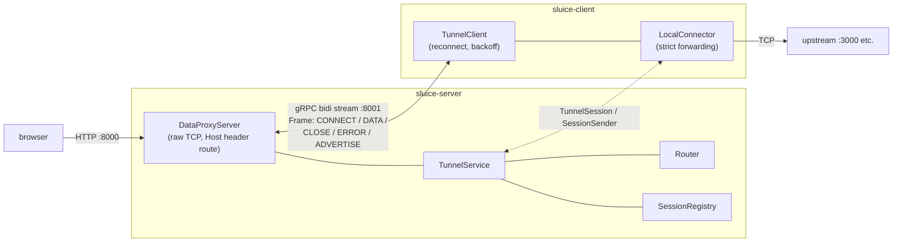
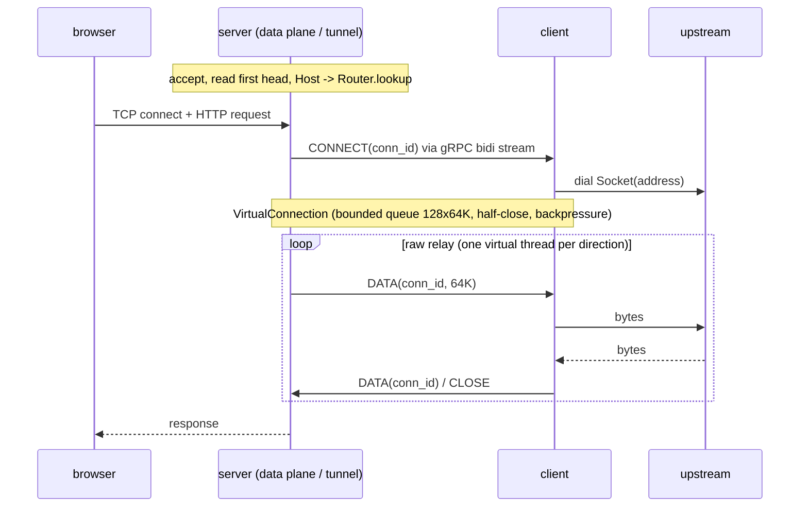
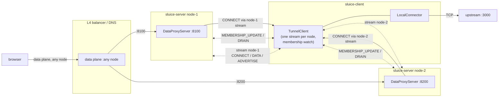

# sluice

HTTP tunnel over a gRPC bidirectional stream, built on Spring Boot 4.1 and Spring gRPC.

A single gRPC bidi stream multiplexes virtual TCP connections (`conn_id`). The data plane is a raw TCP proxy: the request head is inspected for routing (Host / :authority), so WebSocket upgrades and HTTP keep-alive pass through transparently. All blocking I/O runs on virtual threads; outbound frames flow through a bounded queue honoring gRPC flow control.

## Architecture





- one bidi stream per client; each proxied TCP connection becomes a `conn_id` on that stream
- server: accept, route by `Host`, `VirtualConnection` + `CONNECT`, then raw relay (`SocketRelay`, one virtual thread per direction)
- client: `CONNECT`, dial the local upstream (strict forwarding), same raw relay; upstream URLs with `https://` are dialed with TLS (trust-all)
- flow control: bounded queues end to end; the gRPC send path honors `isReady()` on a dedicated sender thread

## Modules

- `sluice-proto` - `.proto` contract, generated stubs, and the shared tunnel primitives (`VirtualConnection`, `SessionSender`, `SocketRelay`)
- `sluice-server` - exit node: gRPC control plane (`spring.grpc.server.port`, default 8001) + raw TCP data plane (`sluice.data-port`, default 8000) + actuator and management console (`server.port`, default 8081)
- `sluice-client` - tunnel client: connects to the server, advertises upstreams, dials local upstreams on CONNECT, reconnects with exponential backoff (1s..30s)
- `sluice-it` - full stack integration tests running the real server and client applications in one JVM (proxying, reconnect after server restart, wrong-token rejection)
- `sluice-example-upstream` - minimal sample upstream for manual checks (`It works` over http/1.1 and h2c)

## Build

```
./mvnw verify
```

Requires JDK 25+.

Build the executable jars first (the `-exec.jar` files below are produced by this):

```
./mvnw -DskipTests package
```

## Run

```
# terminal 1: upstream (sample server speaking http/1.1 and h2c on one port)
java -jar sluice-example-upstream/target/sluice-example-upstream-0.0.1-SNAPSHOT-exec.jar 31080

# terminal 2: server
java -jar sluice-server/target/sluice-server-0.0.1-SNAPSHOT-exec.jar \
  --sluice.token=SECRET

# terminal 3: client
java -jar sluice-client/target/sluice-client-0.0.1-SNAPSHOT-exec.jar \
  --sluice.server-url=grpc://127.0.0.1:8001 \
  '--sluice.client.upstream[0]'.host=demo.local \
  '--sluice.client.upstream[0]'.target=http://127.0.0.1:31080 \
  --sluice.token=SECRET

# terminal 4: request through the tunnel (routed by the Host header / :authority)
curl -H 'Host: demo.local' http://127.0.0.1:8000/
curl --http2-prior-knowledge -H 'Host: demo.local' http://127.0.0.1:8000/
```

`sluice.server-url` schemes: `grpc://` (plaintext) / `grpcs://` (TLS; `--sluice.insecure=true` skips
verification). For mutual TLS set `sluice.tls-bundle` to a `spring.ssl.bundle.pem.*` bundle whose
keystore holds the client certificate and whose truststore holds the CA of the server certificate;
on the server side pair `spring.grpc.server.ssl.bundle` with `spring.grpc.server.ssl.client-auth=REQUIRE`
and a truststore with the CA of the client certificates.

### Native image (client / server)

GraalVM native images (require a GraalVM JDK; AOT processing and `native-image` run in
the `package` phase):

```
./mvnw -pl sluice-client -am -Pnative -DskipTests package
./mvnw -pl sluice-server -am -Pnative -DskipTests package
sluice-client/target/sluice-client --sluice.server-url=grpc://127.0.0.1:8001 ...
sluice-server/target/sluice-server --sluice.token=SECRET ...
```

TLS termination on the data port (same upstream / server / client):

```
# self-signed cert registered as an SSL bundle, then restart the server with
#   --sluice.data-tls-bundle=data-plane
#   --spring.ssl.bundle.pem.data-plane.keystore.certificate=cert.pem
#   --spring.ssl.bundle.pem.data-plane.keystore.private-key=cert-key.pem
openssl req -x509 -newkey rsa:2048 -keyout cert-key.pem -out cert.pem -days 1 -nodes -subj /CN=localhost

# h2 over TLS (ALPN) / http/1.1 fallback / plaintext on the same port
curl --http2 -k -H 'Host: demo.local' https://127.0.0.1:8000/ -v -o /dev/null 2>&1 | grep 'using HTTP/2' -A2
curl --http1.1 -k -H 'Host: demo.local' https://127.0.0.1:8000/
```

TLS passthrough routed by SNI: see "SNI routing" below.

## TCP port routing

Upstreams with `listen-port` are routed by the listen port instead of the connection
head: the server opens one listener per advertised port and relays every accepted
connection verbatim -- no head parsing, no rewriting -- so any TCP protocol (ssh,
postgres, redis, ...) tunnels through, not just HTTP. Such an upstream is reached only
through its port: its `host` takes no part in Host / SNI routing on the data port, so it
neither captures http traffic for that host nor becomes the catch-all when empty.

```
# terminal 1: any TCP server, e.g. redis
redis-server --port 6379

# terminal 2: server (listeners bind on the data host)
java -jar sluice-server/target/sluice-server-0.0.1-SNAPSHOT-exec.jar \
  --sluice.token=SECRET

# terminal 3: client; the upstream target is a tcp:// URL
java -jar sluice-client/target/sluice-client-0.0.1-SNAPSHOT-exec.jar \
  --sluice.server-url=grpc://127.0.0.1:8001 \
  '--sluice.client.upstream[0]'.host=redis.local \
  '--sluice.client.upstream[0]'.target=tcp://127.0.0.1:6379 \
  '--sluice.client.upstream[0]'.listen-port=16379 \
  --sluice.token=SECRET

# terminal 4: connect to the advertised port
redis-cli -p 16379 ping
# -> PONG
```

The listener is bound when the client advertises and released on disconnect; the
server acknowledges the advertisement and reports back the listen ports it could
not bind (outside `sluice.tcp-port-range`, held by another connected client, or
already taken) -- the client then closes the stream and re-advertises with
backoff. The listen ports must be exposed on the host (`docker -p`, firewall) --
the deployment delta against the single data port.

## SNI routing

Where TCP port routing keys on the listen port, these two variants route a TLS
connection by the server name of its ClientHello:

- **TLS passthrough** (`sluice.client.upstream[n].tls-passthrough=true`): the data
  plane relays the TLS bytes untouched and routes by the ClientHello SNI; the upstream
  terminates TLS and presents its own certificate. The upstream target is a plain
  `tcp://` URL — the tunneled bytes are the already-encrypted TLS records.
- **TLS termination** (the default): the data plane terminates TLS (an SSL bundle via
  `sluice.data-tls-bundle` is required) and falls back to the SNI host name when the
  decrypted stream carries no HTTP `Host` header (any protocol works, e.g. RESP); the
  upstream target is then an everyday plaintext `tcp://` / `http://` URL.

Passthrough example, all four terminals:

```
# terminal 1: a TLS upstream (any TLS server works; here openssl's demo server
#   serving the current directory over HTTPS)
echo 'it-works-sni' > index.html
openssl req -x509 -newkey rsa:2048 -keyout cert-key.pem -out cert.pem -days 1 -nodes -subj /CN=demo.local
openssl s_server -accept 34443 -cert cert.pem -key cert-key.pem -WWW

# terminal 2: server (no TLS configuration on the data port)
java -jar sluice-server/target/sluice-server-0.0.1-SNAPSHOT-exec.jar \
  --sluice.token=SECRET

# terminal 3: client; tls-passthrough relays the TLS records as-is
java -jar sluice-client/target/sluice-client-0.0.1-SNAPSHOT-exec.jar \
  --sluice.server-url=grpc://127.0.0.1:8001 \
  '--sluice.client.upstream[0]'.host=demo.local \
  '--sluice.client.upstream[0]'.target=tcp://127.0.0.1:34443 \
  '--sluice.client.upstream[0]'.tls-passthrough=true \
  --sluice.token=SECRET

# terminal 4: request by SNI; --resolve sends ClientHello server_name=demo.local
#   to the data port
curl -k --resolve demo.local:8000:127.0.0.1 https://demo.local:8000/index.html
# -> it-works-sni
```

## Configuration (server)

| Property | Default | Description |
|---|---|---|
| `sluice.token` | (unset = auto-generated; the generated token is written to a temporary file whose path is logged) | bearer token for tunnel clients (`Authorization: Bearer <token>`, constant-time compare) |
| `sluice.token-file` | - | read the token from a file |
| `sluice.data-host` | `0.0.0.0` | bind address of the data plane |
| `sluice.data-port` | `8000` | data plane port |
| `sluice.data-tls-bundle` | - | SSL bundle name for data plane TLS termination (h2 / http/1.1 via ALPN); unset = plaintext only (TLS connections are served by upstreams with `tls-passthrough=true`) |
| `sluice.tcp-port-range` | (unset = any port) | listen ports a client may claim for tcp routes, comma separated single ports or `min-max` ranges (e.g. `9000-9010,8080`); a port outside the range is not bound |
| `sluice.http-load-balance` | `smallest-client-id` | target picked when several clients serve the same domain: `smallest-client-id` (deterministic across nodes) / `round-robin` (per node) / `random` |
| `sluice.tcp-load-balance` | `smallest-client-id` | target picked for tcp routes when several clients serve the same listen port (same values); the listen port bind itself always follows the smallest client id |
| `sluice.node.id` | hostname | cluster node id (logs, metrics, membership) |
| `sluice.node.public-url` | - | control plane address clients use for this node (e.g. `grpcs://sluice-0.example.com`); empty = reachable at the bootstrap address only |
| `sluice.cluster.nodes` | (empty = single-node) | cluster members, `nodeId=publicUrl` entries; see "Cluster (scale-out)" |
| `sluice.cluster.warmup` | `10s` | readiness stays down this long after start |
| `sluice.cluster.drain-grace` | `10s` | wait for in-flight virtual connections during drain |
| `sluice.cluster.membership-poll` | `10s` | membership re-read interval (pushed to clients on change) |
| `sluice.access-log.enabled` | `true` | emit access logs to the `sluice.access` logger (logfmt, INFO) |
| `sluice.access-log.types` | `connection,request` | comma separated event types: `connection` (accept/close with route, transport, bytes, duration) / `request` (the head request of each connection -- method, path, HTTP version; keep-alive successors are not parsed, so a browser reusing one connection logs a single `request` line until the connection closes) |
| `sluice.access-log.rate-limit.enabled` | `true` | rate limit access log lines per line kind, syslog style (as in `rate-limited-logger`) |
| `sluice.access-log.rate-limit.max-rate` | `10` | max lines emitted per line kind (`conn-accept` / `conn-close` / `request`) within one period; the line that reaches the limit is still emitted |
| `sluice.access-log.rate-limit.period` | `10s` | rate limit window; lines beyond the limit are counted and one `type=ratelimit` summary line reports the suppressed count when the period rolls over |
| `spring.grpc.server.port` | `8001` | gRPC control plane port |
| `server.port` | `8081` | actuator (health / info / prometheus) and the management console (`/console`) |

## Configuration (client)

| Property | Default | Description |
|---|---|---|
| `sluice.server-url` | - | tunnel server endpoint (`grpc://host:port` / `grpcs://host:port`) |
| `sluice.client.id` | random, once per process | stable client identity sent as `x-sluice-id` on every stream; breaks route / listen-port ties in cluster mode |
| `sluice.client.upstream[n].host` | - | public domain routed by the server (empty = catch-all) |
| `sluice.client.upstream[n].target` | - | upstream URL: `http://` (default when the scheme is omitted), `https://` (TLS terminated by the client), or `tcp://` (raw relay, e.g. a TLS endpoint in passthrough mode) |
| `sluice.client.upstream[n].preserve-host` | `true` | `false` rewrites the request Host / `:authority` to the target's `host[:port]` |
| `sluice.client.upstream[n].tls-passthrough` | `false` | TLS connections for the upstream are relayed untouched (routed by ClientHello SNI, the upstream terminates TLS) instead of terminated on the data plane |
| `sluice.client.upstream[n].listen-port` | `0` | public port the server listens on for this upstream; connections are relayed as raw TCP routed by the listen port -- no head parsing, no rewriting -- so any protocol (ssh, postgres, redis, ...) tunnels through. The listener is bound on advertise and released on disconnect; bind it on the host (`docker -p`, firewall) to expose it |
| `sluice.token` / `sluice.token-file` | - | authentication token |
| `sluice.insecure` | `false` | skip TLS verification |
| `sluice.tls-bundle` | - | SSL bundle for the `grpcs://` control plane connection: keystore = client certificate (mutual TLS), truststore = CAs to verify the server; takes precedence over `sluice.insecure` |
| `sluice.keep-alive-time` | `30s` | interval of the gRPC keepalive ping towards the server |
| `sluice.keep-alive-timeout` | `10s` | how long a keepalive ping answer may take before the channel is torn down |
| `sluice.strict-forwarding` | `true` | only dial upstreams present in the map |
| `management.server.port` | `9001` | actuator port |

## gRPC keepalive

The tunnel is one long-lived gRPC stream; NAT / load balancers silently drop idle
connections, so both sides keep it warm with HTTP/2 pings and the server-side values are
set explicitly in `sluice-server/src/main/resources/application.properties`:

| Setting | Value | Reason |
|---|---|---|
| server `spring.grpc.server.keepalive.time` / `spring.grpc.server.keepalive.timeout` | `30s` / `10s` | the server pings clients and reaps dead ones (session and routes released ~40s after silent death) |
| server `spring.grpc.server.keepalive.permit.time` / `spring.grpc.server.keepalive.permit.without-calls` | `10s` / `true` | client pings every 30s; grpc's default permit (5m) risks `GOAWAY TOO_MANY_PINGS` |
| client `sluice.keep-alive-time` / `sluice.keep-alive-timeout` | `30s` / `10s` | pings keep NAT mappings alive; an unanswered ping tears the channel down and the reconnect backoff (1s..30s) takes over |

Application-level `KEEPALIVE` frames are not sent: the gRPC (HTTP/2) ping already
provides liveness. The frame type stays in the proto for future use and is handled as a
no-op on both sides. `GrpcKeepAliveTest` (sluice-it) guards the behavior with a 1s-ping
channel.

## Cluster (scale-out)

Run N server nodes: every client keeps one tunnel stream to every node, so each node holds
the full route table locally -- no shared store, no inter-node hop.

Deployment requirements (independent of the front end):

- each node's control plane is reachable from clients at its own address (per-node URL)
- data plane connections may land on any node (plain L4 balancing is enough)

```
# terminal 1/2: two nodes sharing one membership list and token
java -jar sluice-server/target/sluice-server-0.0.1-SNAPSHOT-exec.jar \
  --sluice.token=SECRET --sluice.node.id=node-1 \
  --spring.grpc.server.port=8101 --sluice.data-port=8100 --server.port=18180 \
  --sluice.cluster.nodes=node-1=grpc://127.0.0.1:8101,node-2=grpc://127.0.0.1:8201
java -jar sluice-server/target/sluice-server-0.0.1-SNAPSHOT-exec.jar \
  --sluice.token=SECRET --sluice.node.id=node-2 \
  --spring.grpc.server.port=8201 --sluice.data-port=8200 --server.port=18181 \
  --sluice.cluster.nodes=node-1=grpc://127.0.0.1:8101,node-2=grpc://127.0.0.1:8201

# terminal 3: client -- server-url is only the bootstrap; the node list is learned
# via ListNodes and one stream is opened per node
java -jar sluice-client/target/sluice-client-0.0.1-SNAPSHOT-exec.jar \
  --sluice.server-url=grpc://127.0.0.1:8101 --sluice.client.id=client-1 \
  '--sluice.client.upstream[0]'.host=demo.local \
  '--sluice.client.upstream[0]'.target=http://127.0.0.1:31080 \
  --sluice.token=SECRET

# terminal 4: either node serves the route
curl -H 'Host: demo.local' http://127.0.0.1:8100/
curl -H 'Host: demo.local' http://127.0.0.1:8200/
```



Each node routes with its own full copy of the route table (every client advertises to
every node), so the data plane never hops between nodes.

Behavior:

- membership: `sluice.cluster.nodes` lists the members as `nodeId=publicUrl` entries (the
  local node is always included). It is pushed to every client on connect and whenever it
  changes (`MEMBERSHIP_UPDATE` frame); the client opens/closes per-node streams accordingly.
  A node with an empty public url is reachable at the address the client bootstrapped with
- routing: a domain (or listen port) claimed by several clients is served by the one with
  the smallest `sluice.client.id` -- deterministically on every node, since every node sees
  every client. A smaller id takes over a bound listen port on advertise; a larger id gets
  the port rejected and retries
- lifecycle: readiness (`/actuator/health/readiness`) is DOWN for `sluice.cluster.warmup`
  after start (clients connect first) and while draining. On shutdown the node sends a
  `DRAIN` frame, waits up to `sluice.cluster.drain-grace` for in-flight virtual connections
  to finish, then closes the streams. Clients keep their other nodes' streams and retry the
  drained node with backoff
- configuration: cluster mode refuses to start without an explicit `sluice.token` /
  `sluice.token-file` (per-node random tokens would break clients connected to every node)
- observability: every metric carries a `node` common tag; the client health details show
  the per-node stream states

Without `sluice.cluster.nodes` the server runs single-node and nothing above applies
(`ListNodes` returns just the node itself).

## Cluster (TLS)

The control plane can serve TLS (`spring.grpc.server.ssl.bundle`), so a front end routes
per node by SNI without terminating TLS. Verified end to end with a self-signed certificate;
no code difference from the plaintext cluster, only configuration:

```
# self-signed cert for the gRPC control plane
openssl req -x509 -newkey rsa:2048 -keyout grpc-key.pem -out grpc-cert.pem -days 1 -nodes -subj /CN=localhost

# terminal 1/2: same cluster as above, plus the TLS bundle on every node
java -jar sluice-server/target/sluice-server-0.0.1-SNAPSHOT-exec.jar \
  --sluice.token=SECRET --sluice.node.id=node-1 \
  --spring.grpc.server.port=8101 --sluice.data-port=8100 --server.port=18180 \
  --sluice.cluster.nodes=node-1=grpcs://127.0.0.1:8101,node-2=grpcs://127.0.0.1:8201 \
  --spring.grpc.server.ssl.bundle=grpc-control \
  --spring.ssl.bundle.pem.grpc-control.keystore.certificate=file:grpc-cert.pem \
  --spring.ssl.bundle.pem.grpc-control.keystore.private-key=file:grpc-key.pem
java -jar sluice-server/target/sluice-server-0.0.1-SNAPSHOT-exec.jar \
  --sluice.token=SECRET --sluice.node.id=node-2 \
  --spring.grpc.server.port=8201 --sluice.data-port=8200 --server.port=18181 \
  --sluice.cluster.nodes=node-1=grpcs://127.0.0.1:8101,node-2=grpcs://127.0.0.1:8201 \
  --spring.grpc.server.ssl.bundle=grpc-control \
  --spring.ssl.bundle.pem.grpc-control.keystore.certificate=file:grpc-cert.pem \
  --spring.ssl.bundle.pem.grpc-control.keystore.private-key=file:grpc-key.pem

# terminal 3: client -- grpcs:// bootstrap, insecure trusts the self-signed cert;
# membership URLs (grpcs://) are dialed with the same setting
java -jar sluice-client/target/sluice-client-0.0.1-SNAPSHOT-exec.jar \
  --sluice.server-url=grpcs://127.0.0.1:8101 --sluice.insecure=true --sluice.client.id=client-1 \
  '--sluice.client.upstream[0]'.host=demo.local \
  '--sluice.client.upstream[0]'.target=http://127.0.0.1:31080 \
  --sluice.token=SECRET

# terminal 4: both nodes serve over their TLS control planes
curl -H 'Host: demo.local' http://127.0.0.1:8100/
curl -H 'Host: demo.local' http://127.0.0.1:8200/

# the control plane negotiates h2 via ALPN
echo | openssl s_client -connect 127.0.0.1:8101 -alpn h2 2>/dev/null | grep 'ALPN protocol'
```

E2E coverage: `ClusterGrpcTlsE2ETests` (sluice-it) -- both nodes serve, failover after a
node stops, and h2 negotiation on the TLS endpoint.

## Mutual TLS (server <-> client)

The server requires a client certificate (`client-auth=REQUIRE`) and the client presents one
from an SSL bundle (`sluice.tls-bundle`); no `sluice.insecure` needed. Example with a local CA:

```sh
# a private CA and two leaf certificates signed by it
openssl req -x509 -newkey rsa:2048 -nodes -keyout ca-key.pem -out ca.pem \
  -days 3650 -subj /CN=sluice-ca -addext basicConstraints=critical,CA:TRUE
openssl req -newkey rsa:2048 -nodes -keyout server-key.pem -out server.csr -subj /CN=localhost
openssl x509 -req -in server.csr -CA ca.pem -CAkey ca-key.pem -days 3650 \
  -extfile <(printf 'subjectAltName=DNS:localhost,IP:127.0.0.1\n') -out server-cert.pem
openssl req -newkey rsa:2048 -nodes -keyout client-key.pem -out client.csr -subj /CN=sluice-client
openssl x509 -req -in client.csr -CA ca.pem -CAkey ca-key.pem -days 3650 -out client-cert.pem
openssl verify -CAfile ca.pem server-cert.pem client-cert.pem
```

```sh
# server: terminate TLS on the control plane and require client certificates
java -jar sluice-server/target/sluice-server-0.0.1-SNAPSHOT-exec.jar \
  --sluice.token=SECRET --spring.grpc.server.port=8001 --sluice.data-port=8000 \
  --spring.grpc.server.ssl.bundle=grpc-control \
  --spring.grpc.server.ssl.client-auth=REQUIRE \
  --spring.ssl.bundle.pem.grpc-control.keystore.certificate=file:server-cert.pem \
  --spring.ssl.bundle.pem.grpc-control.keystore.private-key=file:server-key.pem \
  --spring.ssl.bundle.pem.grpc-control.truststore.certificate=file:ca.pem

# client: keystore = the client certificate, truststore = the CA that signed the server cert
java -jar sluice-client/target/sluice-client-0.0.1-SNAPSHOT-exec.jar \
  --sluice.server-url=grpcs://127.0.0.1:8001 --sluice.tls-bundle=grpc-client --sluice.client.id=client-1 \
  '--sluice.client.upstream[0]'.host=demo.local \
  '--sluice.client.upstream[0]'.target=http://127.0.0.1:31080 \
  --spring.ssl.bundle.pem.grpc-client.keystore.certificate=file:client-cert.pem \
  --spring.ssl.bundle.pem.grpc-client.keystore.private-key=file:client-key.pem \
  --spring.ssl.bundle.pem.grpc-client.truststore.certificate=file:ca.pem \
  --sluice.token=SECRET
```

The client bundle is applied to every node connection (the bootstrap and the membership
`grpcs://` URLs alike). `client-auth` also accepts `OPTIONAL` / `WANT` / `NONE`.

E2E coverage: `ClusterGrpcMutualTlsE2ETests` (sluice-it) -- mTLS to both nodes with failover,
rejection of a certificate-less client, and TLS termination / passthrough on the data plane
over the mTLS tunnel.

## Health / metrics

- server `GET /actuator/health` - liveness, UP while the process lives; details `clients`
  (connected tunnel clients) and `draining`. `/actuator/health/readiness` is DOWN during the
  cluster warmup window and while draining (see "Cluster (scale-out)")
- client `GET /actuator/health` - UP while at least one per-node tunnel stream is established;
  the `nodes` detail lists each node's stream state
- `GET /actuator/prometheus` - JVM metrics plus `sluice_tunnel_bytes_total`, `sluice_connections_active`, `sluice_reconnect_total`

## Console

`http://<server>:8081/console` (the actuator port) shows the live state of one node: the
public listeners, connected clients with their upstreams and traffic, the http / tcp route
tables with the client each route resolves to, the cluster membership and the effective
settings. A "Find a route" box tells which client serves a given Host header without
touching load balancing state. The page refreshes every 2s.

The console has no authentication yet: keep `server.port` off public networks.

Built with Mustache and htmx 4 (vendored in `static/console/js/vendor`, source URL in the
template); static assets ship pre-compressed (`.br` / `.gz`) and content-hashed.

## Docker

Images are built with Cloud Native Buildpacks (Spring Boot plugin, no Dockerfile). Build deps
first, then the app module only -- running `build-image` on the reactor also hits the library
modules. Append `-Pnative` for GraalVM native images:

```
./mvnw -pl sluice-server -am package spring-boot:build-image -DskipTests
./mvnw -pl sluice-client -am package spring-boot:build-image -DskipTests

./mvnw -pl sluice-server -am -Pnative -DskipTests package
./mvnw -pl sluice-server -Pnative -DskipTests spring-boot:build-image   # native image
./mvnw -pl sluice-client -am -Pnative -DskipTests package
./mvnw -pl sluice-client -Pnative -DskipTests spring-boot:build-image   # native image
```

This produces `sluice-server:latest` and `sluice-client:latest`. Run:

```
docker run -p 8000:8000 -p 8001:8001 sluice-server --sluice.token=SECRET
docker run sluice-client --sluice.server-url=grpc://host.docker.internal:8001 \
  '--sluice.client.upstream[0]'.host=demo.local '--sluice.client.upstream[0]'.target=http://host.docker.internal:3000 --sluice.token=SECRET
```

## Constraints and notes

- The data plane relays raw bytes. With `preserve-host=false` the authority (`Host` / `:authority`) is rewritten on every request of the connection by a best-effort stream rewriter (both HTTP/1.1 and h2): upgraded connections (WebSocket, h2c upgrade, CONNECT) are rewritten up to the protocol switch, and any head or frame the rewriter cannot reproduce (non ASCII headers, HPACK failures) degrades that connection to verbatim passthrough.
- h2 specific: the rewriter assumes the upstream negotiates the spec-default frame and HPACK limits (16 KiB max frame size, 4096 header table size, 64 KiB header list) and does not track tighter upstream SETTINGS values.
