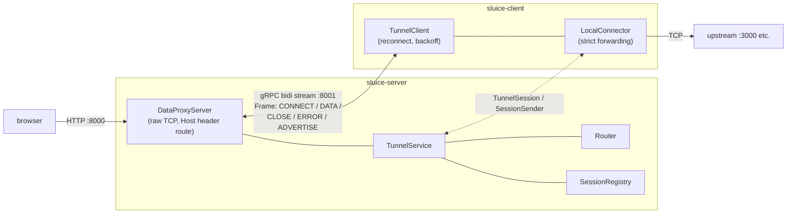
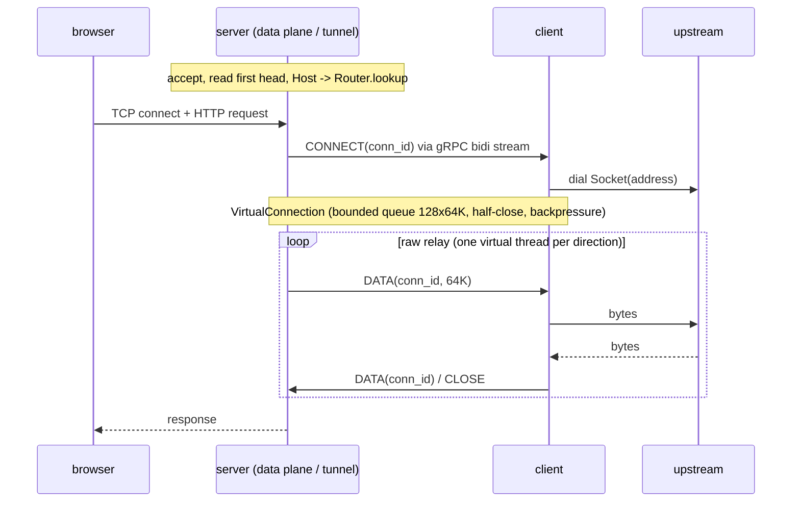

sluice
======

HTTP tunnel over a gRPC bidirectional stream, built on Spring Boot 4.1 and Spring gRPC.

A single gRPC bidi stream multiplexes virtual TCP connections (`conn_id`). The data plane is a raw TCP proxy: only the Host header of the first request is inspected, so WebSocket upgrades and HTTP keep-alive pass through transparently. All blocking I/O runs on virtual threads; outbound frames flow through a bounded queue honoring gRPC flow control.

Architecture
------------

- one bidi stream per client; each proxied TCP connection becomes a `conn_id` on that stream
- server: accept, route by `Host`, `VirtualConnection` + `CONNECT`, then raw relay (`SocketRelay`, one virtual thread per direction)
- client: `CONNECT`, dial the local upstream (strict forwarding), same raw relay; upstream URLs with `https://` are dialed with TLS (trust-all)
- flow control: bounded queues end to end; the gRPC send path honors `isReady()` on a dedicated sender thread

Modules
-------

- `sluice-proto` - `.proto` contract, generated stubs, and the shared tunnel primitives (`VirtualConnection`, `SessionSender`, `SocketRelay`)
- `sluice-server` - exit node: gRPC control plane (`spring.grpc.server.port`, default 8001) + raw TCP data plane (`sluice.data-port`, default 8000) + actuator (`server.port`, default 8081)
- `sluice-client` - tunnel client: connects to the server, advertises upstreams, dials local upstreams on CONNECT, reconnects with exponential backoff (1s..30s)
- `sluice-it` - full stack integration tests running the real server and client applications in one JVM (proxying, reconnect after server restart, wrong-token rejection)
- `sluice-example-upstream` - minimal sample upstream for manual checks (`It works` over http/1.1 and h2c)

Build
-----

    ./mvnw verify

Requires JDK 25+.

Build the executable jars first (the `-exec.jar` files below are produced by this):

    ./mvnw -DskipTests package

Run
---

    # terminal 1: upstream (sample server speaking http/1.1 and h2c on one port)
    java -jar sluice-example-upstream/target/sluice-example-upstream-0.0.1-SNAPSHOT-exec.jar 31080

    # terminal 2: server
    java -jar sluice-server/target/sluice-server-0.0.1-SNAPSHOT-exec.jar \
      --sluice.token=SECRET

    # terminal 3: client
    java -jar sluice-client/target/sluice-client-0.0.1-SNAPSHOT-exec.jar \
      --sluice.server-url=grpc://127.0.0.1:8001 \
      --sluice.client.upstream[0].host=demo.local \
      --sluice.client.upstream[0].target=http://127.0.0.1:31080 \
      --sluice.token=SECRET

    # terminal 4: request through the tunnel (routed by the Host header / :authority)
    curl -H 'Host: demo.local' http://127.0.0.1:8000/
    curl --http2-prior-knowledge -H 'Host: demo.local' http://127.0.0.1:8000/

`sluice.server-url` schemes: `grpc://` (plaintext) / `grpcs://` (TLS; `--sluice.insecure=true` skips verification).

TLS termination on the data port (same upstream / server / client):

    # self-signed cert registered as an SSL bundle, then restart the server with
    #   --sluice.data-tls-bundle=data-plane
    #   --spring.ssl.bundle.pem.data-plane.keystore.certificate=cert.pem
    #   --spring.ssl.bundle.pem.data-plane.keystore.private-key=cert-key.pem
    openssl req -x509 -newkey rsa:2048 -keyout cert-key.pem -out cert.pem -days 1 -nodes -subj /CN=localhost

    # h2 over TLS (ALPN) / http/1.1 fallback / plaintext on the same port
    curl --http2 -k -H 'Host: demo.local' https://127.0.0.1:8000/ -v -o /dev/null 2>&1 | grep 'using HTTP/2' -A2
    curl --http1.1 -k -H 'Host: demo.local' https://127.0.0.1:8000/

TLS passthrough routed by SNI: see "SNI routing" below.

SNI routing
-----------

Two variants route a TLS connection by the server name of its ClientHello:

- **TLS passthrough** (`sluice.client.upstream[n].tls-passthrough=true`): the data
  plane relays the TLS bytes untouched and routes by the ClientHello SNI; the upstream
  terminates TLS and presents its own certificate. The upstream target is a plain
  `tcp://` URL — the tunneled bytes are the already-encrypted TLS records.
- **TLS termination** (the default): the data plane terminates TLS (an SSL bundle via
  `sluice.data-tls-bundle` is required) and falls back to the SNI host name when the
  decrypted stream carries no HTTP `Host` header (any protocol works, e.g. RESP); the
  upstream target is then an everyday plaintext `tcp://` / `http://` URL.

Passthrough example, all four terminals:

    # terminal 1: a TLS upstream (any TLS server works; here openssl's demo server
    #   serving the current directory over HTTPS)
    echo 'it-works-sni' > index.html
    openssl req -x509 -newkey rsa:2048 -keyout cert-key.pem -out cert.pem -days 1 -nodes -subj /CN=demo.local
    openssl s_server -accept 34443 -cert cert.pem -key cert-key.pem -WWW

    # terminal 2: server (no TLS configuration on the data port)
    java -jar sluice-server/target/sluice-server-0.0.1-SNAPSHOT-exec.jar \
      --sluice.token=SECRET

    # terminal 3: client; tls-passthrough relays the TLS records as-is
    java -jar sluice-client/target/sluice-client-0.0.1-SNAPSHOT-exec.jar \
      --sluice.server-url=grpc://127.0.0.1:8001 \
      --sluice.client.upstream[0].host=demo.local \
      --sluice.client.upstream[0].target=tcp://127.0.0.1:34443 \
      --sluice.client.upstream[0].tls-passthrough=true \
      --sluice.token=SECRET

    # terminal 4: request by SNI; --resolve sends ClientHello server_name=demo.local
    #   to the data port
    curl -k --resolve demo.local:8000:127.0.0.1 https://demo.local:8000/index.html
    # -> it-works-sni

Configuration (server)
----------------------

| Property | Default | Description |
|---|---|---|
| `sluice.token` | (unset = auto-generated; the generated token is written to a temporary file whose path is logged) | bearer token for tunnel clients (`Authorization: Bearer <token>`, constant-time compare) |
| `sluice.token-file` | - | read the token from a file |
| `sluice.data-host` | `0.0.0.0` | bind address of the data plane |
| `sluice.data-port` | `8000` | data plane port |
| `sluice.data-tls-bundle` | - | SSL bundle name for data plane TLS termination (h2 / http/1.1 via ALPN); unset = plaintext only (TLS connections are served by upstreams with `tls-passthrough=true`) |
| `spring.grpc.server.port` | `8001` | gRPC control plane port |
| `server.port` | `8081` | actuator (health / info / prometheus) |

Configuration (client)
----------------------

| Property | Default | Description |
|---|---|---|
| `sluice.server-url` | - | tunnel server endpoint (`grpc://host:port` / `grpcs://host:port`) |
| `sluice.client.upstream[n].host` | - | public domain routed by the server (empty = catch-all) |
| `sluice.client.upstream[n].target` | - | upstream URL: `http://` (default when the scheme is omitted), `https://` (TLS terminated by the client), or `tcp://` (raw relay, e.g. a TLS endpoint in passthrough mode) |
| `sluice.client.upstream[n].preserve-host` | `true` | `false` rewrites the request Host / `:authority` to the target's `host[:port]` |
| `sluice.client.upstream[n].tls-passthrough` | `false` | TLS connections for this upstream are relayed untouched (routed by ClientHello SNI, the upstream terminates TLS) instead of terminated on the data plane |
| `sluice.token` / `sluice.token-file` | - | authentication token |
| `sluice.insecure` | `false` | skip TLS verification |
| `sluice.strict-forwarding` | `true` | only dial upstreams present in the map |
| `management.server.port` | `9001` | actuator port |

Health / metrics
----------------

- server `GET /actuator/health` - UP while at least one tunnel client is connected
- client `GET /actuator/health` - UP while the tunnel stream is established
- `GET /actuator/prometheus` - JVM metrics plus `sluice_tunnel_bytes_total`, `sluice_connections_active`, `sluice_reconnect_total`

Docker
------

Images are built with Cloud Native Buildpacks (Spring Boot plugin, no Dockerfile):

    ./mvnw -pl sluice-server -am package spring-boot:build-image -DskipTests
    ./mvnw -pl sluice-client -am package spring-boot:build-image -DskipTests

This produces `sluice/server:latest` and `sluice/client:latest`. Run:

    docker run -p 8000:8000 -p 8001:8001 sluice/server --sluice.token=SECRET
    docker run sluice/client --sluice.server-url=grpc://host.docker.internal:8001 \
      --sluice.client.upstream[0].host=demo.local --sluice.client.upstream[0].target=http://host.docker.internal:3000 --sluice.token=SECRET

Tests
-----

- unit: `VirtualConnection` (chunk reassembly / half-close / failure), `Router` (fallback / first-target / replace), `TokenValidator`, `UpstreamParser`, `LocalConnector` (strict forwarding)
- integration (`sluice-it`): full stack E2E - HTTP round trip and keep-alive reuse, WebSocket passthrough, reconnection after a server restart, and wrong-token rejection, against the real server and client applications
